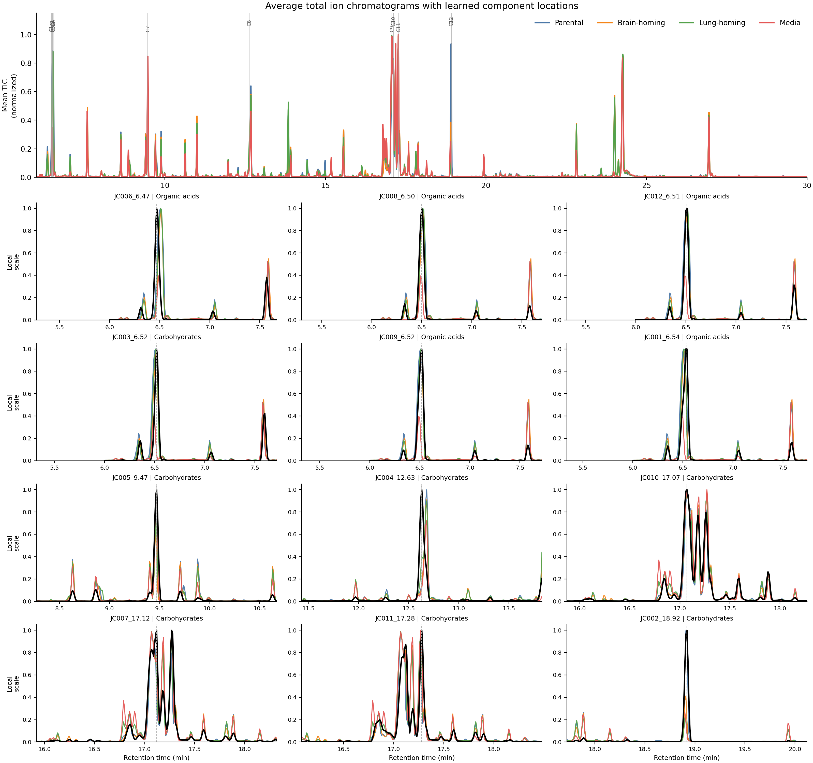
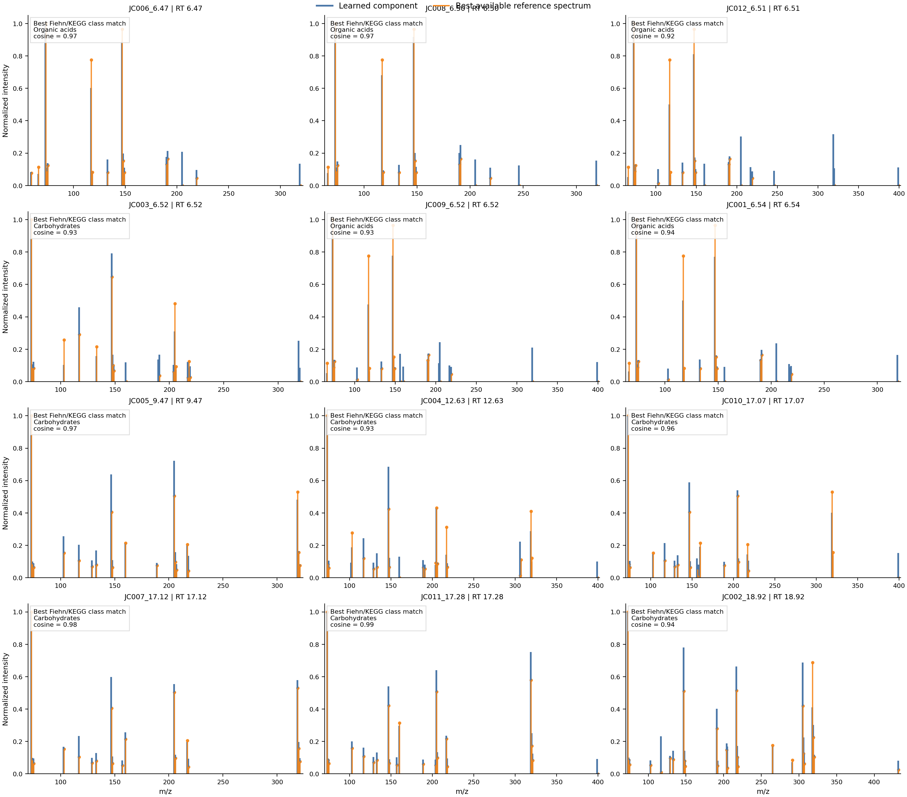
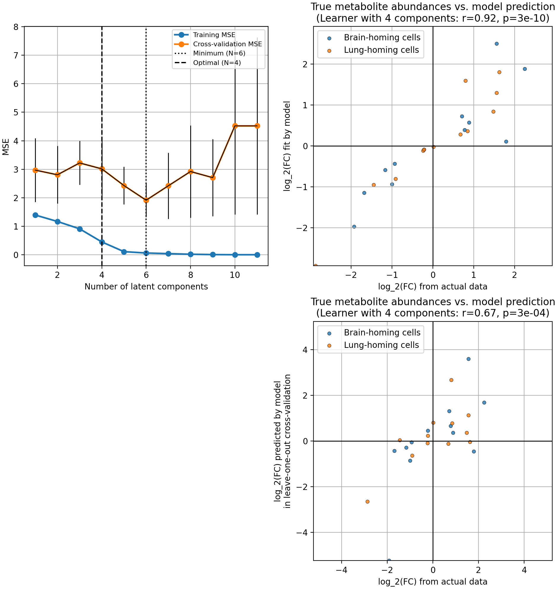
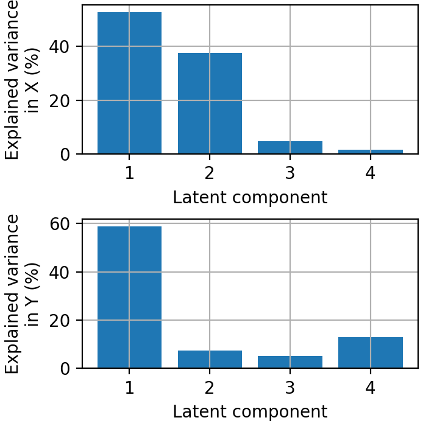
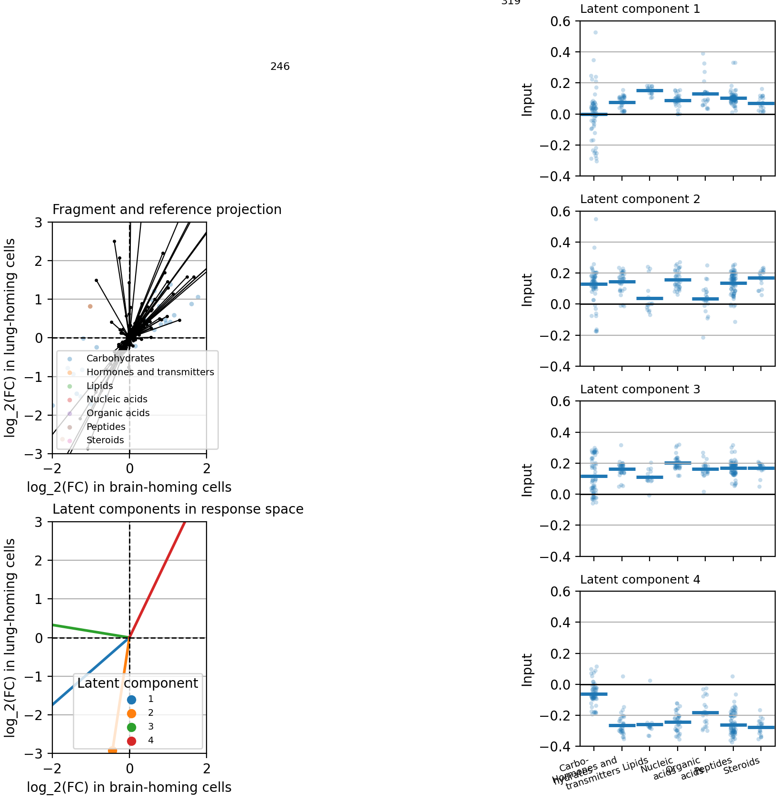

# Results

The present MetaboLiteLearner 2.0 result set comes from the staged MDA-MB-231 benchmark run used throughout this study. On that dataset, the joint extractor learned 12 usable components, the downstream mixed-model stage retained 12 fold-change peaks, and the partial least squares learner selected 4 latent components. This section reports that result set directly rather than treating the 2024 paper as the controlling reference.

## Joint component extraction yields a compact but visibly split representation

The first result is the extraction stage itself. Starting from the aligned sample matrices, the 2.0 workflow produced 12 learned components with explicit chromatographic profiles, spectra, abundance vectors, effect summaries, and post hoc library matches. The extracted component table is dominated by two matched classes, with 7 components assigned most strongly to carbohydrates and 5 to organic acids. Median supervision `R^2` across components is approximately `0.99`, indicating that the extracted abundance vectors remain strongly aligned with the study design.

The chromatogram overview makes the current extractor behavior explicit. The top panel shows the average total ion chromatogram (TIC) for parental, brain-homing, lung-homing, and media samples, while the 12 aligned panels below it show each learned component chromatogram over the corresponding local TIC neighborhood. This view is useful because it exposes both strengths and weaknesses of the present representation in the same figure. The learned components land in chemically active TIC regions and track local structure in a cell-type-aware way, but several components are concentrated into the same retention-time neighborhoods, especially around 6.5 minutes and 17.1-17.3 minutes. That visible oversplitting remains the main current weakness of the 2.0 representation.

*Figure 1. Average TIC overview and local component chromatograms for the 12 learned MetaboLiteLearner 2.0 components. The top panel shows the normalized mean TIC for parental, brain-homing, lung-homing, and media samples across the full run. The 12 aligned panels below show each learned component chromatogram in black over the corresponding local mean TIC segment for each sample type. The figure is intended to make the extracted representation legible: components follow real chromatographic structure, but repeated neighborhoods around 6.5 minutes and 17.1-17.3 minutes reveal the current oversplitting limitation directly.*

## The extracted spectra remain chemically structured under post hoc reference matching

The second result is that the learned component spectra remain interpretable after moving to joint extraction. Each of the 12 components can be placed against its best available post hoc reference spectrum from the staged Fiehn/KEGG library asset. In the current repository snapshot, that asset supports class-level reference spectra rather than named compound identities, so the comparison is deliberately conservative: the figure asks whether learned spectra recover recognizable fragmentation structure, not whether the pipeline already assigns definitive metabolite names.

The match grid shows that the learned spectra are not arbitrary basis vectors. Across the current run, the strongest matches are again concentrated in carbohydrates and organic acids, consistent with the component table and with the later latent-space interpretation. Several panels show close agreement in the dominant fragments, while others show partial agreement with extra or split peaks that likely reflect co-elution or component fragmentation in the learned representation. That is the right qualitative behavior for the present stage of the method: chemically legible spectra remain available even before component merging is improved.

*Figure 2. Learned component spectra and best available post hoc Fiehn/KEGG reference matches for the 12 extracted components. Each panel compares the normalized learned spectrum against the best-matching reference spectrum from the staged library asset and reports the cosine similarity. Because the tracked reference table in this repository is class-level, the labels should be interpreted as best available chemical classes rather than definitive metabolite identities.*

## The 2.0 learner selects four latent components

The downstream learner was fit on the 12 retained component spectra and the corresponding brain-homing and lung-homing fold-change estimates. Leave-one-out cross-validation reached its minimum error at 6 latent components, but the one-standard-error rule selected a 4-component operating model. That model achieved a fitted correlation of `r = 0.92` (`P = 3.2 x 10^-10`) and a leave-one-out correlation of `r = 0.67` (`P = 3.1 x 10^-4`) between observed and predicted log2 fold changes.

*Figure 3. Model-selection and prediction diagnostics for the present MetaboLiteLearner 2.0 analysis. The selected model uses four latent components after one-standard-error selection from a cross-validation minimum at six components. The figure summarizes training fit, cross-validation fit, and the observed-versus-predicted relationship for the 12 retained fold-change peaks.*

These numbers are not yet the statement of a universal predictive method. They are evidence that the component-first representation preserves enough structure for the learner to recover nontrivial response geometry even after moving away from the older peak-window front end.

## Four latent components retain most of the response structure

The 4-component model explains approximately `96.6%` of the predictor variance and `84.0%` of the response variance. The first latent component alone captures `58.8%` of response variance, while the remaining components partition the residual structure rather than collapsing it into noise. This is the main compactness result of the 2.0 run: the current workflow produces a small, inspectable latent model without reducing the problem to a single dominant axis.

*Figure 4. Variance explained by the four selected latent components in predictor and response space. The current 2.0 model is highly compressive in Y while still preserving most of the structure present in the learned spectral representation.*

## The learned space remains interpretable after joint extraction

The interpretability figure connects the PLS loadings back to the joint extractor outputs and to post hoc library projection. In the present analysis, the learned space remains chemically readable despite the component splitting problem. The dominant projected classes are carbohydrates and organic acids, and the response-space geometry still separates shared abundance shifts from lineage-specific behavior. This is the main biological payoff of the 2.0 rewrite: learning the intermediate representation does not destroy interpretability.

*Figure 5. Fragment-level and reference-projection interpretation for the present MetaboLiteLearner 2.0 analysis. The left panels show response-space coefficients and latent-component orientation, while the right panels show projected class structure from post hoc reference matching. The figure is interpretable enough to support biological discussion, but the repeated retention-time neighborhoods also make the current oversplitting limitation visible.*

## Comparison with the earlier MetaboLiteLearner workflow

The earlier MetaboLiteLearner study remains the right prior-work comparison because it established the feasibility of fragmentation-first learning [10]. The present manuscript asks a different question: what happens when the intermediate representation is learned rather than fixed by peak windows?

| Workflow | Front end | Learned or retained entities | Selected latent components |
| --- | --- | --- | --- |
| 2024 MetaboLiteLearner | Bulk peak extraction and summed spectra | 153 retained spectra | 5 |
| MetaboLiteLearner 2.0 (present study) | Joint component extraction | 12 retained components / 12 fold-change peaks | 4 |

The comparison should not be read as a simple bigger-versus-smaller table. The 2.0 result set is more compressed because the extractor itself has changed. The main value of the current paper is therefore methodological: it shows that fragmentation-first learning still works after replacing fixed-window extraction with a learned component representation, while also making the main remaining failure mode explicit.

## Reproducibility note

The executable workflow that generated these results is implemented in [../metabolite_learner/joint_extract.py](../metabolite_learner/joint_extract.py), [../metabolite_learner/workflow.py](../metabolite_learner/workflow.py), and [../metabolite_learner/pls.py](../metabolite_learner/pls.py). The manuscript figure exports shown here are assembled by [../scripts/export_paper_figures.py](../scripts/export_paper_figures.py), and the staged run summarized here is documented in [../docs/reports/previous_dataset_run.md](../docs/reports/previous_dataset_run.md).
